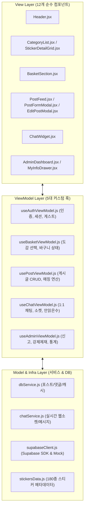
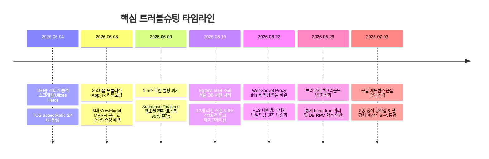

# 🤝 [Project Handoff Document] 드래곤 빌리지 3 카드교환소 전체 프로젝트 인수인계서

> **문서 대상자**: 코덱스(Codex), 차기 개발자, 포트폴리오 작성 AI 어시스턴트  
> **문서 목적**: 프로젝트의 기획 의도, 아키텍처, 데이터베이스 스키마, 핵심 트러블슈팅 히스토리, 포트폴리오 추출 포인트를 한눈에 파악하여 즉시 개발 및 포트폴리오 제작에 착수할 수 있도록 지원합니다.

---

## 📌 1. 프로젝트 기본 정보 (Overview)

| 항목 | 내용 |
| :--- | :--- |
| **프로젝트명** | 드래곤 빌리지 3 카드교환소 (DV3 Sticker Exchange) |
| **서비스 성격** | 모바일 수집형 게임 유저들을 위한 실시간 카드 교환 및 1:1 채팅 P2P 웹 플랫폼 |
| **라이브 주소** | [https://dv3-sticker.vercel.app](https://dv3-sticker.vercel.app) |
| **개발 기간** | 2026.06 ~ 2026.09 (실서비스 운영 및 지속적 고도화) |
| **기술 스택** | **Frontend**: React (Vite), MVVM Pattern (Custom Hook ViewModels), Vanilla CSS, Lucide-React<br/>**Backend/DB**: Supabase (PostgreSQL 15, Realtime WebSockets, Row Level Security)<br/>**Deploy/CI/CD**: Vercel (Auto Deployment), Web3Forms API (장애 모니터링 경보)<br/>**Data/Crawler**: Ulixee Hero (동적 헤드리스 브라우저 스크래퍼) |

---

## 🏛️ 2. 시스템 아키텍처 및 디렉터리 구조 (Architecture)

### 1) 디자인 패턴: MVVM (Model-View-ViewModel)
3,500라인이 넘던 단일 거대 `App.jsx` 모놀리식을 전면 해체하여, 비즈니스 로직과 화면 UI를 완벽히 격리한 MVVM 패턴을 준수합니다.



### 2) 핵심 디렉터리 맵
```bash
카드교환소/
├── src/
│   ├── components/            # 순수 UI View 컴포넌트 (12개 파일)
│   ├── features/              # 기능별 특화 모듈
│   │   ├── auth/              # 인증 및 유저 드로어
│   │   ├── basket/            # 수집 바구니
│   │   ├── board/             # 독립 거래 게시판
│   │   ├── chat/              # 1:1 실시간 채팅 위젯 & unreadTracking
│   │   ├── post/              # 피드 및 작성/수정 모달
│   │   └── sticker/           # 3x3 도감 그리드
│   ├── viewmodels/            # 5대 전용 ViewModel 커스텀 훅
│   ├── utils/                 # XSS 방지, 슬래시 디코딩 등 보안 유틸
│   ├── App.jsx                # 뷰모델과 뷰를 묶어주는 150라인 엔트리 컨트롤러
│   ├── stickersData.js        # 180종 카드 메타데이터 (별점, 이미지 CDN, 골든여부)
│   ├── dbService.js           # 포스트 CRUD 및 60초 인메모리 캐싱 모듈
│   ├── chatService.js         # Supabase Realtime 웹소켓 통신 모듈
│   └── supabaseClient.js      # 클라이언트 인스턴스 및 MockDB 폴백
├── database/                  # SQL 스키마 및 RLS 룰 (supabase_schema.sql)
├── docs/                      # 개발일지(dev-log), 아키텍처맵, 케이스 스터디
├── scripts/                   # 리전 스캐너(scan_regions.js), 마이그레이터(migrate_data.js)
├── public/                    # 8종 정적 공략 HTML, sitemap.xml, robots.txt
├── MASTER_BLUEPRINT.md        # 프로젝트 종합 청사진
├── PORTFOLIO_CASE_STUDY_SUPABASE_OUTAGE.md # 포트폴리오 전용 트러블슈팅 케이스스터디
└── HANDOFF.md                 # 본 인수인계 문서
```

---

## ⚡ 3. 핵심 기능별 세부 구현 스펙 (Core Features)

### 1) 180종 스티커 도감 및 양방향 매칭 엔진
* **인게임 감성 TCG 레이아웃**: 20개 카테고리 팩, 각 팩당 1~9번 카드를 3x3 바둑판 그리드로 렌더링.
  * 반응형 종횡비 `aspectRatio: '3 / 4'` 및 `objectFit: 'contain'` 적용으로 일러스트 왜곡 차단.
  * 마우스 좌클릭(`Haves`: 줄 수 있는 카드) / 우클릭(`Wants`: 받고 싶은 카드) / 키보드 단축키(`4`: 이전 팩, `6`: 다음 팩) 지원.
  * 9번 골든 스티커(`isGolden: true`)는 인게임 규칙에 따라 교환 불가 처리 및 토스트 경고 노출.
* **매칭 엔진 (`checkMatching`)**:
  * 유저의 바구니와 타인의 게시글을 교차 대조하여 **"교환 가능(완벽 매칭)"** 여부를 연산하고, 일치하는 카드를 5성/4성 단위로 묶어 배지로 시각화.

### 2) 1:1 실시간 채팅 & 백그라운드 알림 시스템
* **Supabase Realtime WebSocket**: 데이터베이스 `chat_messages` 테이블의 `INSERT` 이벤트를 실시간 웹소켓으로 수신.
* **낙관적 업데이트 (Optimistic UI)**: 전송 버튼을 누르는 즉시 로컬 `chatMessages` 배열에 주입하여 네트워크 지연 없이 **0.001초 만에 말풍선 표출**.
* **단일 리스너 통합 파이프라인**: 다중 채널 충돌을 막기 위해 글로벌 알림 리스너(`subscribeAllMyMessages`) 하나로 이벤트를 수신하고, 현재 열려있는 활성 방으로 메시지를 주입.
* **백그라운드 알림 보장**: 브라우저 탭을 내리거나 다른 탭으로 이동해도 실시간 띵동 오디오 알림음 재생 및 상단 헤더/FAB 배지 카운트 누적.
* **재연결 복구 모듈 (`unreadTracking.js`)**: 일시적 네트워크 끊김 후 재접속 시 마지막 읽은 시각(`lastReadTimestamp`) 기반으로 안 읽은 메시지를 완벽 복구하며, 전용 단위 테스트(`tests/chatUnread.test.js`)로 검증.

### 3) 독립 거래 게시판 (Board)
* 교환 피드와 별도로 자유 소통 및 게임 내 알 코드를 나눌 수 있는 회원용 게시판.
* 게시글 CRUD 및 댓글 작성/삭제가 비동기적으로 유기 작동.

### 4) 드빌3 젬 강화 효율 계산기 및 정적 공략 가이드
* 젬 등급, 시작/목표 강화 수치, 전설 젬 보너스를 입력하면 **실질 소모 골드와 1P당 가성비 단가(S~D 등급)**를 실시간 자동 연산.
* 검색엔진 로봇(SEO)과 구글 애드센스 심사를 통과하기 위해 8종의 고품질 정보성 정적 HTML 및 React SPA 탭(`GuideSection.jsx`)으로 완벽 구현.

---

## 🗄️ 4. 데이터베이스 스키마 및 보안 (Database & RLS)

### 1) 주요 테이블 구조
1. `users`: 닉네임(PK), 비밀번호, 생성일시
2. `posts`: 교환글 (작성자, 줄 스티커 목록, 받을 스티커 목록, 연락처, 거래완료 여부, 생성일시)
3. `post_comments`: 교환글 댓글
4. `board_posts`: 독립 거래 게시판 본문
5. `board_comments`: 독립 거래 게시판 댓글
6. `chat_rooms`: 1:1 대화방 (식별자, 구매자, 판매자, 대상 포스트 ID, 생성일시)
7. `chat_messages`: 대화 메시지 (방 ID, 발신자, 메시지 내용, 읽음 여부, 생성일시)
8. `visit_logs`: 방문자 통계 로그

### 2) RLS (Row Level Security) 핵심 설계 원칙
* **무단 조작 차단**: 전체 테이블에 RLS를 활성화하고, 커스텀 DB 함수 `validate_request_user(nickname)`를 통해 요청자가 해당 데이터의 실제 소유주인지 검증.
* **단일 책임 원칙에 따른 충돌 해결**:
  * `chat_messages` INSERT: 발신자 명의 사칭 방지(`validate_request_user(sender)`)만 검증.
  * `chat_rooms` INSERT: 방을 개설하는 구매자(`validate_request_user(buyer_nickname)`)만 검증.
* **HTTP 헤더와 Realtime 세션 격리**: HTTP 인증 헤더가 없는 백그라운드 WebSocket 이벤트 배포 세션이 RLS에 막히지 않도록 SELECT 정책을 분리 보완.
* **관리자('간장') RLS 바이패스**: 악성 글 및 사기 게시글 삭제를 위해, 닉네임이 관리자('간장')이고 비밀번호가 일치하면 소유권 검사 없이 강제 삭제/수정할 수 있는 바이패스 로직 적용.

---

## 🚨 5. 핵심 트러블슈팅 및 장애 복구 전말 (Portfolio Highlights)

포트폴리오나 이력서에 반드시 들어가야 할 가장 중요한 실무 트러블슈팅 내역입니다.



### [장애 케이스 1] Supabase Egress 한도 초과 먹통 장애 ➡️ 6초 만의 데이터 복구
* **상황**: 1.5초 폴링과 캐시 부재로 인해 월 5GB 대역폭이 조기 소진되어 REST API가 전면 차단됨(HTTP 503).
* **조치**:
  1. 17개 AWS 리전 자동 스캔 스크립트(`scripts/scan_regions.js`)로 Transaction Pooler(포트 6543) 활성 접속 통로 확보.
  2. `pg.Pool` 병렬 마이그레이션 도구(`scripts/migrate_data.js`)와 1,000건 단위 청크 벌크 INSERT로 **유저 497명, 게시글 403개, 채팅방 730개, 메시지 3,276건을 단 6초 만에 100% 무결성 이전 복구**.
  3. `fetchPosts`에 **60초 인메모리 캐시** 적용 및 CUD 발생 시 즉각 캐시 무효화(`clearPostsCache`)로 조회 쿼리 80% 절감.

### [기술 난관 2] ES6 Proxy와 웹소켓의 `this` 바인딩 충돌
* **상황**: DB 보안 프록시 객체가 웹소켓을 감싸면서 내부 `this` 컨텍스트가 유실되어 실시간 채팅이 얼어붙는 현상 발생.
* **조치**: 웹소켓 구독 함수들은 Proxy를 거치지 않고 싱글톤 원본(`rawSupabase`)을 직접 바라보도록 바이패스하고, **0.001초 낙관적 업데이트(Optimistic UI)**를 이식.

### [트레이드오프 3] 백그라운드 탭 최적화 vs 실시간 알림음의 딜레마
* **상황**: 대역폭을 아끼기 위해 탭 비활성화 시 모든 소켓을 끊었더니, 백그라운드에서 실시간 채팅 알림(띵동)이 울리지 않음.
* **조치 (하이브리드 분리)**:
  * 무거운 **Presence(온라인 접속자) 채널과 목록 폴링 타이머는 백그라운드 진입 시 즉시 해제**.
  * 가벼운 **글로벌 메시지 알림 채널은 백그라운드에서도 영구 유지**하여 트래픽 방어와 알림 신뢰성을 동시 달성.

### [아키텍처 4] 3,500줄 모놀리식 ➡️ MVVM 뷰모델 분리 & 순환 의존성 해결
* **상황**: 거대 `App.jsx`에서 바구니 상태와 포스트 상태가 서로를 참조하여 양방향 자동 수정을 지원하다 훅 초기화 순서 에러(순환 의존성/TDZ) 발생.
* **조치**: 5대 커스텀 훅 ViewModel로 관심사를 분리하고, `useRef` 지연 바인딩과 ES6 Getter 패턴으로 런타임 의존성 꼬임 원천 해결.

---

## 💻 6. 실행 및 배포 환경 가이드 (How to Run)

### 1) 로컬 개발 환경 실행
```bash
# 의존성 설치
npm install

# 로컬 개발 서버 실행 (기본 포트: 5173 또는 5174)
npm run dev

# 프로덕션 빌드 무결성 검증
npm run build
```

### 2) 환경 변수 설정 (`.env`)
```ini
VITE_SUPABASE_URL=https://jomoeqhvimscrsrniwkb.supabase.co
VITE_SUPABASE_ANON_KEY=eyJhbGciOiJIUzI1NiIsInR5cCI6IkpXVCJ9...
DATABASE_URL=postgres://postgres.jomoeqhvimscrsrniwkb:wnsdud0724@@aws-1-ap-southeast-2.pooler.supabase.com:6543/postgres
```

### 3) Vercel 프로덕션 자동 배포
* GitHub `master` 브랜치에 코드가 푸시되면 Vercel CI/CD가 자동으로 트리거되어 1분 이내에 프로덕션 웹버전에 실시간 반영됩니다.

---

## 🎯 7. 코덱스(Codex)를 위한 포트폴리오 작업 가이드라인

코덱스가 포트폴리오 사이트나 문서를 작성할 때 반드시 포함해야 할 **핵심 소구점과 정량적 수치**입니다:

1. **정량적 개선 수치 강조**:
   * API 폴링을 웹소켓 이벤트 구독으로 전환하여 **네트워크 호출 99% 절감**.
   * 무료 티어(5GB) 한도 초과 위기를 **월 1GB 미만으로 영구 안정화(80% 이상 대역폭 절약)**.
   * 서울 DB 차단 비상사태에서 **4,406건의 실서비스 데이터를 단 6초 만에 데이터 손실 0%로 이전 복구**.
   * 낙관적 업데이트 적용으로 **메시지 전송 체감 지연 시간을 0.001초로 단축**.
   * 거대 모놀리식 3,500라인을 5개 ViewModel과 12개 순수 View로 분리한 **MVVM 리팩토링**.
2. **권장 포트폴리오 섹션 구성**:
   * **프로젝트 한 줄 소개 & 아키텍처 다이어그램**
   * **핵심 기능 4선 (3x3 도감/바구니, 1:1 실시간 채팅, 양방향 매칭, 젬 강화 계산기)**
   * **🔥 트러블슈팅 딥다이브 (Egress 한도 초과 먹통 장애 ➡️ 6초 마이그레이션 ➡️ 5대 영구 방어선 구축)**
   * **기술적 의사결정 (Short Polling vs WebSocket, Proxy this 바인딩 바이패스, RLS 단일 책임 원칙)**
   * **성장과 배운 점 (클라우드 인프라 비용 감각, 이벤트 기반 아키텍처, 비동기 상태 관리)**

---

## 📂 8. 관련 문서 및 소스코드 색인
* 📄 **포트폴리오 전용 케이스 스터디**: [PORTFOLIO_CASE_STUDY_SUPABASE_OUTAGE.md](file:///c:/Antigravity/카드교환소/PORTFOLIO_CASE_STUDY_SUPABASE_OUTAGE.md)
* 🗺️ **프로젝트 마스터 청사진**: [MASTER_BLUEPRINT.md](file:///c:/Antigravity/카드교환소/MASTER_BLUEPRINT.md)
* 📐 **아키텍처 도면도**: [docs/architecture/ARCHITECTURE_MAP.md](file:///c:/Antigravity/카드교환소/docs/architecture/ARCHITECTURE_MAP.md)
* 🛠️ **리전 스캐너 & 마이그레이터**: `scripts/scan_regions.js`, `scripts/migrate_data.js`
* 💬 **실시간 채팅 서비스**: `src/chatService.js`, `src/features/chat/useChatViewModel.js`, `src/features/chat/unreadTracking.js`
* 🧪 **채팅 복구 단위 테스트**: `tests/chatUnread.test.js`
