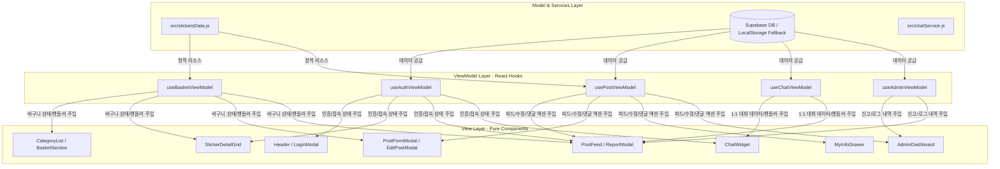

# 🗺️ 드래곤 빌리지 3 카드교환소 마스터 청사진 (MASTER_BLUEPRINT)

본 문서는 프로젝트의 전체 아키텍처, 핵심 파일 역할, 그리고 최신 기능 명세서(v4.9)를 보관하는 통합 기술 명세입니다.

---

## 🏗️ 시스템 아키텍처 (v4.9 - MVVM)

---

## 📂 파일 구조 및 MVVM 분할 명세

이 프로젝트의 핵심 파일들은 MVVM 패턴에 맞춰 다음과 같이 모듈화되어 배치되어 있습니다:

### 1. 진입점 및 환경 (Entry)
*   **`index.html`**: 검색엔진 노출을 위한 정보(SEO)와 한국어 설정이 적용된 사이트 뼈대 파일입니다.
*   **`src/main.jsx`**: React 앱의 진입점으로, `App.jsx`와 `index.css`를 연결해 브라우저에 화면을 띄워줍니다.
*   **`src/App.jsx`**: **애플리케이션의 컨트롤러 및 통합 레이어**입니다. 5가지 ViewModel 훅을 호출하고 12가지 View 컴포넌트에 데이터를 양방향 주입(Props Binding)해 주는 역할을 담당하며, 훅 간의 순환 의존성 해결을 위해 **콜백(Callback) 기반 단방향 데이터 흐름**을 적용해 느슨한 결합을 완성했습니다.

### 2. Model & Services (비즈니스 데이터 & 외부 API)
*   **`src/stickersData.js`**: 180장의 드빌3 정규 스티커 정보, 별 등급(Stars), 등급별 색상, 황금테두리(`isGolden`) 여부, 위하이브 CDN 이미지 링크가 매핑된 데이터 모델입니다.
*   **`src/supabaseClient.js`**: Supabase 서버 통신을 담당합니다. 테이블(`posts`, `chat_rooms` 등)과의 실시간 연동을 제어하며, DB 생성 누락 시 `mockDB` 로컬스토리지를 통한 자동 폴백을 완벽 처리합니다.
*   **`src/chatService.js`**: 1:1 채팅방의 고유 식별 ID(`room-유저A-유저B`) 생성, 수발신 이력 관리, 안 읽은 알림음 트리거 및 메시지 로드 백엔드 통신 서비스 모듈입니다.

### 3. ViewModels (상태 제어 및 핵심 비즈니스 로직 - `src/viewmodels/`)
*   **`useAuthViewModel.js`**: 계정 생성, 로그인/로그아웃 세션, 실시간 접속자 목록(Presence) 동기화 상태를 관리합니다.
*   **`useBasketViewModel.js`**: 도감 카테고리 전환 및 상단 장바구니(`myHaves`, `myWants`) 스티커 선택 상태를 실시간 제어하며, 변경 시 외부에 알리는 `onBasketChange` 콜백을 호출합니다. (포스트 관련 의존성 100% 제거)
*   **`usePostViewModel.js`**: 피드 포스트 목록 스캔, 아코디언 접기 상태, 신규 등록, 끌올, 수정 및 댓글/신고 관련 이벤트 제어 상태를 관리합니다.
*   **`useChatViewModel.js`**: 대화방 목록 갱신, 안 읽은 알림 토스트, 메시지 실시간 폴링 및 전송 상태를 담당합니다.
*   **`useAdminViewModel.js`**: 관리자 권한 조회, 신고 리스트 제어, 강제 조치(글/댓글 강제 삭제) 및 조치 영구 로그 보존을 처리합니다.

### 4. Views (화면 렌더링용 순수 UI 컴포넌트 - `src/components/`)
*   **`Header.jsx`**: 접속 상태, 관리자 센터 버튼, 로그인/로그아웃 및 내 정보 버튼을 포함한 상단 영역 뷰입니다.
*   **`LoginModal.jsx`**: 사용자 이름 및 패스워드를 요구하는 팝업 로그인 입력 폼입니다.
*   **`CategoryList.jsx`**: 20개의 스티커 팩 바로가기 탭 네비게이션입니다.
*   **`BasketSection.jsx`**: 내가 선택한 임시 스티커 요약 및 교환글 등록 열기 버튼 영역입니다.
*   **`StickerDetailGrid.jsx`**: 3x3 격자 모양의 메인 도감 뷰로 마우스 좌/우클릭을 통한 쾌속 입력 폼을 제공합니다.
*   **`PostFormModal.jsx`**: 연락처 입력 및 스티커 요약이 포함된 신규 글 생성 폼입니다.
*   **`EditPostModal.jsx`**: 작성자가 글을 고칠 때 카테고리 드롭다운 및 3x3 미니 도감 뷰로 직관적인 수정을 보조하는 폼입니다.
*   **`PostFeed.jsx`**: 매칭률이 높은 매칭 뱃지 연산 결과를 보여주는 피드 리스트와 개별 아코디언, 댓글 리스트 및 신고 호출 트리거 뷰입니다.
*   **`ChatWidget.jsx`**: 우하단에 상주하며 실시간 대화 상태 및 안 읽은 뱃지, 신규 메시지 수신 알림을 보여주는 위젯 뷰입니다.
*   **`ReportModal.jsx`**: 신고 접수 및 상세 사유 입력을 처리하는 팝업 뷰입니다.
*   **`AdminDashboard.jsx`**: 관리자(간장)의 승인/삭제 제어 및 조치 완료 로그 조회를 렌더링하는 대시보드 뷰입니다.
*   **`MyInfoDrawer.jsx`**: 사용자가 등록한 글의 내역 조회 및 삭제, 연락처 수정을 보조하는 슬라이드형 드로어 뷰입니다.

---

## ⚡ 교환 매칭 & 실시간 1:1 채팅의 원리 (v4.9)

1. **양방향 복합 바구니**:
   - 한 사용자가 줄 수 있는 카드(Haves)와 받고 싶은 카드(Wants)를 동시에 바구니에 담아 글 하나로 등록합니다.
2. **매칭 알고리즘**:
   - **완벽 매칭 (100% 매칭)**: 내가 줄 수 있는 카드와 상대방이 원하는 카드가 겹치고, 동시에 내가 원하는 카드와 상대방이 줄 수 있는 카드가 겹치는 경우 (`⚡ 100% 매칭 완료!` 배지).
   - **부분 매칭**: 어느 한쪽 방향으로만 교환이 매칭되는 경우 (`💡 부분 매칭` 배지).
3. **실시간 1:1 채팅 및 목록 동기화**:
   - **수신/발신 통합**: 두 대화 당사자의 닉네임을 가나다순으로 자동 정렬하여 하나의 고유 방 ID(`room-닉네임A-닉네임B`)를 생성해 매핑하므로, 여러 글에서 동일인에게 말을 걸더라도 방이 중구난방 쪼개지지 않고 **단 하나의 대화방**으로 결합되어 메시지를 수발신합니다.
   - **안 읽은 카운트 및 알림**: 메시지가 도착하면 알림음과 함께 안 읽은 메시지 수 배지가 올라가며 우하단에 알림 토스트 팝업을 노출합니다.
4. **글 스티커 정보와 상단 바구니 간의 양방향 자동 동기화**:
   - 사용자가 내 교환글을 '수정'하면, 완료 즉시 수정한 카드 데이터(`editHaves`, `editWants`)가 화면 상단 나의 바구니(`myHaves`, `myWants`)에 직접 반영됩니다.
   - 또한 백그라운드 데이터 폴링 발생 시에도 `syncMyBasketFromPost` 모듈이 최근 게시글 정보를 대조하여, 나의 글 정보가 바뀌면 바구니 상태도 자동 연동 업데이트해 줍니다. 이로써 수정 완료 후 매칭 계산 및 뱃지 출력이 딜레이 없이 100% 실시간 동적 재계산됩니다.
5. **바구니 스티커 제거(X) 시 상호 바구니 추가 차단**:
   - Wants 나 Haves 바구니에서 임의의 스티커를 뺄 때, 선택 중인 모드와 관련 없이 해당 바구니에서만 깔끔히 빠지도록 `targetMode` 파라미터 제어를 이식하여 오동작을 원천 차단했습니다.
6. **도감 마우스 좌/우클릭 통합 입력 및 즉시 수정 연동 (v4.9)**:
   - 메인 도감 뷰 내의 개별 스티커 카드를 **마우스 좌클릭 시 보유 카드(Haves), 우클릭 시 필요 카드(Wants)**에 즉시 등록/해제할 수 있도록 입력을 단일 창에 통합했습니다.
   - 내 등록 글이 이미 생성된 상태라면, 도감 카드를 누르는 즉시 `onBasketChange` 콜백이 트리거되어 `App.jsx` 중재 하에 원격 DB와 로컬 피드 데이터가 지연 없이 실시간 수정 및 동기화됩니다.
7. **황금테두리(isGolden) 교환 격리 차단**:
   - 인게임 상 교환불가 스펙인 황금테두리 카드는 도감 내에 🔒 자물쇠 배지와 `"교환 불가"` 어두운 필터링 레이아웃이 적용되며 클릭/선택이 완전 차단됩니다. 원격 DB 백그라운드 동기화 단계에서도 황금테두리 카드는 바구니 연동에서 전격 필터링 배제 처리됩니다.

---

## 🗓️ 업데이트 기록 (2026-06-06)

*   **v4.8 황금테두리 차단, 메인 수정 실시간 연동, 아코디언 피드, 수정 모달 3x3 격자도감화 및 단축키 추가**:
    *   황금테두리 스티커에 🔒자물쇠 및 "교환 불가" 처리하여 도감 선택 완전 격리 차단.
    *   내 글 등록 이후 메인 도감 좌클릭(Haves) / 우클릭(Wants) 클릭 변경 시 원격 DB 및 로컬 피드 실시간 연동 자동 수정 탑재.
    *   피드 교환 대상 카드 목록에 기본적으로 닫힌 아코디언 토글 레이아웃(접이식) 적용.
    *   글 수정 모달 내부의 카드 선택 셀렉터를 메인 도감과 동일한 ◀ ▶ 내비게이션 및 3x3 격자 클릭 도감 구조로 이식 개편.
    *   키보드 '4'번(이전 카테고리), '6'번(다음 카테고리) 단축키를 바인딩하여 페이지 좌우 고속 전환 지원.
*   **v4.9 MVVM 아키텍처 대규모 리팩토링 및 12개 컴포넌트 이관**:
    *   모놀리식 구조 of `App.jsx` 파일(3,500라인)을 MVVM 패턴에 따라 5개의 ViewModel 훅(`viewmodels/`) 및 12개의 View 컴포넌트(`components/`)로 전면 분리.
    *   `useBasketViewModel`의 `posts` 의존성을 전면 제거하고 콜백(`onBasketChange`) 패턴으로 변경하여 순환 의존성 해결 및 의존성 느슨한 결합 실현.
    *   `npm run build`를 통한 정적 컴파일 및 무결성 검증 100% 통과 완료.
*   **v4.9.1 런타임 렌더링 에러 조치 및 Prop Drilling 제거**:
    *   **정적 데이터 직접 참조**: `categories` 데이터를 `App.jsx`에서 자식 뷰 컴포넌트로 전달하던 Prop Drilling을 100% 제거하고, 각 자식 컴포넌트(`CategoryList`, `BasketSection`, `PostFeed`, `PostFormModal`, `MyInfoDrawer`, `EditPostModal`)에서 직접 import하여 사용하도록 수정하여 categories 누락에 의한 런타임 화이트아웃 크래시를 전격 방지.
    *   **수정 모달 라이프사이클 위임**: `EditPostModal`에서 직접 상태를 갱신하던 `setEditingPost`에 대한 직접 접근을 제거하고, `usePostViewModel` 내부에 `handleCloseEditModal` 함수를 설계 및 반영하여 `onClose` 콜백 Props로 우아하게 통합.
    *   **양방향 매칭 연산 복구**: `PostFeed` 렌더링 시 매칭률 배지를 동적 재계산하는 `checkMatching` 함수가 뷰모델 이식 단계에서 누락되어 발생하던 `checkMatching is not a function` 오류를 해결하기 위해 `usePostViewModel` 내부에 해당 매칭 엔진 함수를 온전히 복구 및 리턴하도록 조치.
*   **v4.9.2 화면 중앙 정렬 및 렌더링 오동작/이미지 버그 해결**:
    *   **정중앙 대칭 정렬**: `.app-container` 스타일 클래스에 `align-items: center` 속성을 부여하여 800px 크기의 콘텐츠 카드들이 화면 한가운데에 완벽한 대칭을 이루도록 개선.
    *   **동일 창 내 교환 렌더링**: 카테고리 선택 시 탭 목록 창이 사라지고 스티커 3x3 그리드 도감 창이 그 위치에 교체로 뜨도록 삼항 연산자를 이용한 조건부 렌더링을 적용하여 중복 창이 아래에 생기는 오동작 방지.
    *   **스티커 이미지 매핑 복구**: 스티커 이미지 URL 필드를 `sticker.imageUrl`에서 stickersData의 올바른 실제 속성명인 `sticker.image`로 전면 교체하여 180장의 모든 카드가 고화질 드래곤 일러스트 이미지를 정상적으로 로드해 보여주도록 버그를 최종 해결.
*   **v4.9.3 도감 기획 복구 및 1:1 실시간 채팅 갱신 버그 완벽 수정**:
    *   **카테고리 대표 이미지 렌더링**: 도감 세부 격자 진입 시 카테고리 제목 옆에 1번 스티커 이미지(`repImageUrl`)를 원형 썸네일로 표출해 직관성 극대화.
    *   **플로팅 네비게이션 복원**: 3x3 격자도감 양옆(4번 카드 좌측, 6번 카드 우측)에 둥근 플로팅 화살표 버튼(`◀ 이전`, `▶ 다음`)을 배치. `glass-card` 내부의 `overflow: hidden` 잘림 현상을 해결하기 위해 absolute 버튼들의 래퍼를 최상위 `detail-work-layout` 컨테이너로 격상하여 정상 표출시킴.
    *   **안내 가이드라인 상향 이동**: 도감 내 좌클릭/우클릭 마우스 동작 가이드 배지를 하단에서 타이틀 바로 아래로 옮겨 시인성 향상.
    *   **황금 등급 카드 원색 복구 및 경고 알람**: 회색 그레이스케일 필터 및 불투명도 0.3을 걷어내고 밝은 황금빛 원색으로 렌더링을 복원. 클릭 시 `"🔒 골든 등급 카드는 교환할 수 없습니다!"` 빨간색 미니 경고 팝업이 상단에 3초간 발생하도록 리액트 상태 바인딩.
    *   **1:1 채팅방 목록 실시간 갱신 버그 수정**: `chat_rooms` 테이블에 최초로 대화방이 생성될 때 실시간 갱신을 받기 위한 `subscribeMyRooms` 채널 구독을 `chatService` 및 `useChatViewModel`에 신설해 실시간 생성 및 자동 리프레시 반영.
    *   **피드 매칭 리스트 별 개수별 정리**: 교환 글 피드에서 매칭되는 스티커 목록들을 단순 나열이 아닌 별 등급(`★5성`, `★4성` 등) 그룹으로 묶어 자동 분기하여 보여주는 `renderMatchCardsByStars` 컴포넌트 헬퍼 추가.
    *   **텍스트 단순화**: 매칭 배지에 표출되는 기존 `"100% 매칭 완료"`를 보다 직관적인 `"교환 가능"`으로 문구 정정.
*   **v4.9.4 도감 카드 이미지 꽉 채우기 디자인 개편**:
    *   **꽉 찬 100% 이미지 핏**: 도감 카드 슬롯의 내부 패딩(`padding: 0.6rem 0.5rem 2.6rem`)을 `0`으로 완전 압축하고, `overflow: hidden`을 줘서 모서리 라운딩 경계 내부에 이미지가 100% 꽉 차도록 수정.
    *   **Cover 핏 적용**: 스티커 `img` 요소의 높이 비율을 `75%`에서 `100%`로 넓히고 `objectFit: 'cover'`를 적용하여 드래곤 일러스트가 빈틈없이 화면에 가득 찬 프리미엄 입체감을 가지도록 개편.
    *   **별 등급 및 이름 플로팅 배치**: 별 등급을 왼쪽 상단 반투명 플로팅 배지(`top: 8px`, `left: 8px`)로 띄우고, 스티커 이름을 하단 투명-어두움 그라데이션 오버레이(`linear-gradient`)로 입혀 이미지 영역과 겹쳐서 입체적으로 표시되게 조절하여, 기획 무결성과 감성 그래픽을 함께 극대화.
*   **v4.9.5 스티커 원본 비율 보존 및 종횡비(aspectRatio) 카드 프레임 개편**:
    *   **aspectRatio 3/4 기법 도입**: 기존의 고정 높이(`height: 210px`)를 전격 제거하고, 카드 슬롯 자체의 종횡비(`aspectRatio: '3 / 4'`)를 설정하여 화면 반응형 스케일링 상태에서도 카드 외곽 프레임이 세로로 긴 원본 드래곤 카드 고유 비율을 그대로 따르도록 개선.
    *   **Contain 피팅 복구**: `objectFit: 'cover'`로 일부 일러스트가 잘리던 부작용을 해소하기 위해 `objectFit: 'contain'`으로 복구하면서, 카드 프레임 크기 자체가 원본 이미지 비율과 일치하도록 구현하여 왜곡이나 잘림, 양옆의 빈 여백 없이 100% 꽉 차게 렌더링되도록 시각적 완성도를 마감.
*   **v4.9.6 카테고리 3열 그리드 및 이름 내비게이션, 띄어쓰기 교정**:
    *   **3열 카테고리 뷰 개편**: `CategoryList.jsx`에서 카테고리 선택창 그리드를 기존 자동 정렬 방식에서 고정 3열(`gridTemplateColumns: 'repeat(3, 1fr)'`)로 변경하고 높이를 확대(230px, 썸네일 185px)하여 더욱 웅장하고 높은 해상도의 썸네일 카드 레이아웃을 제공.
    *   **인게임 카테고리 띄어쓰기 정화**: `stickersData.js` 내 `"야생몬스터"` -> `"야생 몬스터"`, `"화산지대"` -> `"화산 지대"`, `"어둠속 존재"` -> `"어둠 속 존재"`, `"놀이시간"` -> `"놀이 시간"`, `"하늘나라"` -> `"하늘 나라"` 등 카테고리 이름과 칩셋 라벨의 띄어쓰기를 완전 정화.
    *   **이동 버튼 명칭화**: `StickerDetailGrid.jsx` 상단 이전/다음 화살표 버튼의 단축키 표기 `(4)`, `(6)`을 지우고, 대신 이전/다음 카테고리의 실제 이름을 동적으로 매핑해 `< 이전카테고리명` 과 `다음카테고리명 >` 형태로 출력하도록 사용자 경험(UX) 개선.
