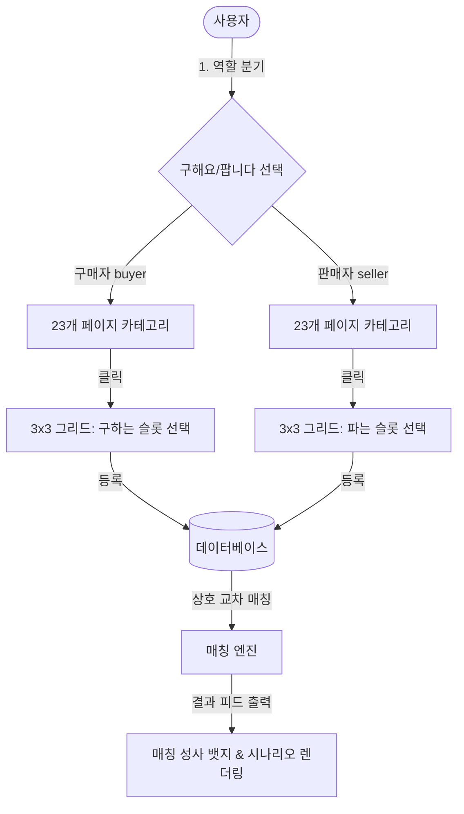

# 🗺️ 드래곤 빌리지 3 카드교환소 마스터 청사진 (MASTER_BLUEPRINT)

본 문서는 프로젝트의 전체 설계 구조와 데이터 흐름을 초보자분들이 쉽게 이해할 수 있도록 정리한 마스터 청사진입니다.

---

## 🏗️ 시스템 아키텍처 (v2)

---

## 📂 파일 구조 설명

이 프로젝트의 핵심 파일들은 다음과 같이 배치되어 있습니다:

- **`index.html`**
  - 사이트의 뼈대가 되는 파일입니다. 검색엔진 노출을 위한 정보(SEO)와 한국어 설정이 적용되어 있습니다.
- **`src/main.jsx`**
  - React 앱의 진입점으로, `App.jsx`와 `index.css`를 연결해 브라우저에 화면을 띄워주는 역할을 합니다.
- **`src/App.jsx`**
  - **애플리케이션의 핵심**입니다. 첫 진입 게이트웨이 화면, 23개 페이지 카테고리 뷰, 3x3 스티커 선택창, 그리고 구매자-판매자간 교차 매칭 알고리즘이 들어 있습니다.
- **`src/index.css`**
  - 앱 전체의 스타일 시트입니다. 다크 네온 보라/핑크 테마와 3x3 슬롯 호버 네온 이펙트 스타일링이 정의되어 있습니다.
- **`src/stickersData.js`**
  - 23개 페이지에 걸친 207개의 스티커 데이터(`page-slot` 형식)와 실제 캡쳐 이미지 매핑 로직이 들어 있습니다.
- **`src/supabaseClient.js`**
  - 데이터 저장소와 통신을 담당합니다. 데이터베이스 연결이 되지 않았을 때도 사용자가 사이트를 시험 운전해볼 수 있도록 "가짜 브라우저 저장소(LocalStorage)" 기능을 백업으로 품고 있습니다.

---

## ⚡ 교환 매칭의 원리 (v2)

1. **구매자 A**가 `1페이지 5번 슬롯` 카드를 구한다고 올립니다.
2. **판매자 B**가 `1페이지 5번 슬롯` 카드를 판다고 올립니다.
3. 매칭 엔진이 두 유저의 **역할(buyer vs seller)**과 **카드 ID(`1-5`)**를 실시간으로 비교하여, 서로 정확히 교차되는 건에 대해 **`⚡ 교환 가능!`** 뱃지를 달아줍니다.

---

## 🗓️ 업데이트 기록 (2026-06-04)
- **최초 프로젝트 생성**: Vite React 기반의 프로젝트 뼈대 구축.
- **실물 도감 추가**: 사용자가 전달한 23개의 캡쳐 이미지를 웹 앱 내 갤러리 형태로 탑재하고, 팝업 확대(Lightbox) 기능 추가.
- **v2 페이지 & 3x3 그리드 개편**:
  - 구매자/판매자 분기 게이트웨이 도입.
  - 23개 캡쳐 썸네일 기반 카테고리 페이지 구현.
  - 인게임 스티커북과 1:1 매칭되는 3x3 스티커 선택 슬롯 제작.
  - 역할 기반 상호 교차 매칭 엔진 고도화.
- **테스트 및 검증**: 프로덕션 빌드 무오류 통과 및 Vercel 자동 배포 확인.
