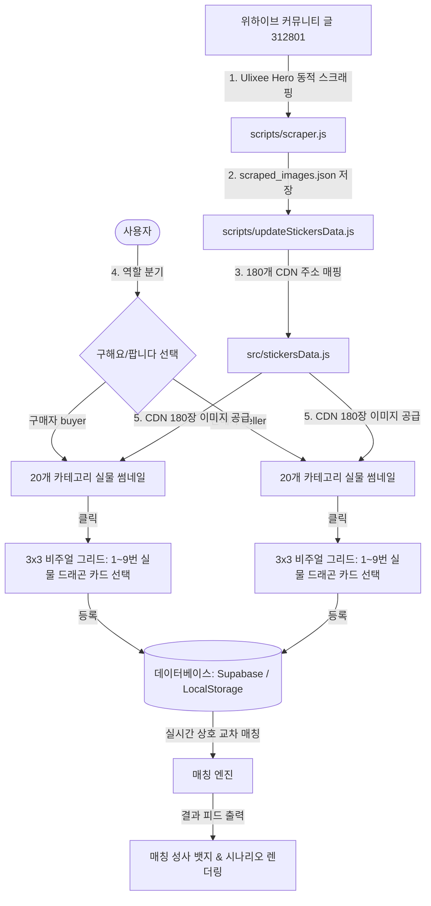

# 🗺️ 드래곤 빌리지 3 카드교환소 마스터 청사진 (MASTER_BLUEPRINT)

본 문서는 프로젝트의 전체 설계 구조와 데이터 흐름을 초보자분들이 쉽게 이해할 수 있도록 정리한 마스터 청사진입니다.

---

## 🏗️ 시스템 아키텍처 (v2.2)

---

## 📂 파일 구조 설명

이 프로젝트의 핵심 파일들은 다음과 같이 배치되어 있습니다:

- **`index.html`**
  - 사이트의 뼈대가 되는 파일입니다. 검색엔진 노출을 위한 정보(SEO)와 한국어 설정이 적용되어 있습니다.
- **`src/main.jsx`**
  - React 앱의 진입점으로, `App.jsx`와 `index.css`를 연결해 브라우저에 화면을 띄워주는 역할을 합니다.
- **`src/App.jsx`**
  - **애플리케이션의 핵심**입니다. 첫 진입 게이트웨이 화면, 20개 정규 카테고리 뷰, 3x3 스티커 선택창, 그리고 구매자-판매자간 교차 매칭 알고리즘이 들어 있습니다.
- **`src/index.css`**
  - 앱 전체의 스타일 시트입니다. 다크 네온 보라/핑크 테마와 3x3 슬롯 호버 네온 이펙트 스타일링이 정의되어 있습니다.
- **`src/stickersData.js`** [UPDATE]
  - 위하이브 동적 크래핑을 통해 빌드된 **180장의 정규 스티커 초고화질 CDN 주소 목록**과 카테고리별 1~9번 매핑 알고리즘이 포함되어 있습니다.
- **`src/supabaseClient.js`**
  - 데이터 저장소와 통신을 담당합니다. 데이터베이스 연결이 되지 않았을 때도 사용자가 사이트를 시험 운전해볼 수 있도록 "가짜 브라우저 저장소(LocalStorage)" 기능을 백업으로 품고 있습니다.
- **`scripts/` (데이터 수집 도구 모음)** [NEW]
  - `scraper.js`: Ulixee Hero 동적 안티봇 우회 브라우저를 띄워 위하이브 공식 글에서 본문 180장의 이미지 src를 순서대로 긁어옵니다.
  - `updateStickersData.js`: 긁어온 180개의 CDN 주소를 리액트 스티커 데이터 파일(`src/stickersData.js`) 구조에 맞게 자동 트랜스폼 및 덮어쓰기하는 데이터 빌드 유틸리티입니다.

---

## ⚡ 교환 매칭의 원리 (v2)

1. **구매자 A**가 `야생몬스터 5번 슬롯` 카드를 구한다고 올립니다.
2. **판매자 B**가 `야생몬스터 5번 슬롯` 카드를 판다고 올립니다.
3. 매칭 엔진이 두 유저의 **역할(buyer vs seller)**과 **카드 ID(`1-5`)**를 실시간으로 비교하여, 서로 정확히 교차되는 건에 대해 **`⚡ 교환 가능!`** 뱃지를 달아줍니다.

---

## 🗓️ 업데이트 기록 (2026-06-04)
- **최초 프로젝트 생성**: Vite React 기반의 프로젝트 뼈대 구축.
- **v2 페이지 & 3x3 그리드 개편**: 구매자/판매자 분기 게이트웨이 및 3x3 슬롯 토글 선택기 탑재.
- **v2.1 카테고리 정제**: 중복 파일 제외한 20개 카테고리 정제 완료 및 누락 카테고리 방어 코딩 적용.
- **v2.2 위하이브 180장 CDN 실시간 맵핑** [LATEST]:
  - Ulixee Hero 크롤러로 위하이브 스티커 가이드 글에서 180장의 실물 이미지 CDN 추출 성공.
  - 3x3 그리드 각각의 슬롯 배경에 **드래곤 실물 카드 렌더러** 장착.
  - 누락된 3개 카테고리(유령 마을, 빛 아래, 하늘나라)를 포함한 20개 전 영역에 실물 카드 3x3 비주얼 완전 매핑.
- **배포 및 트러블슈팅**: Vercel 프로젝트 링크 불일치 에러 교정(`vercel link`) 후 퍼블릭 라이브 최종 배포 완료.
