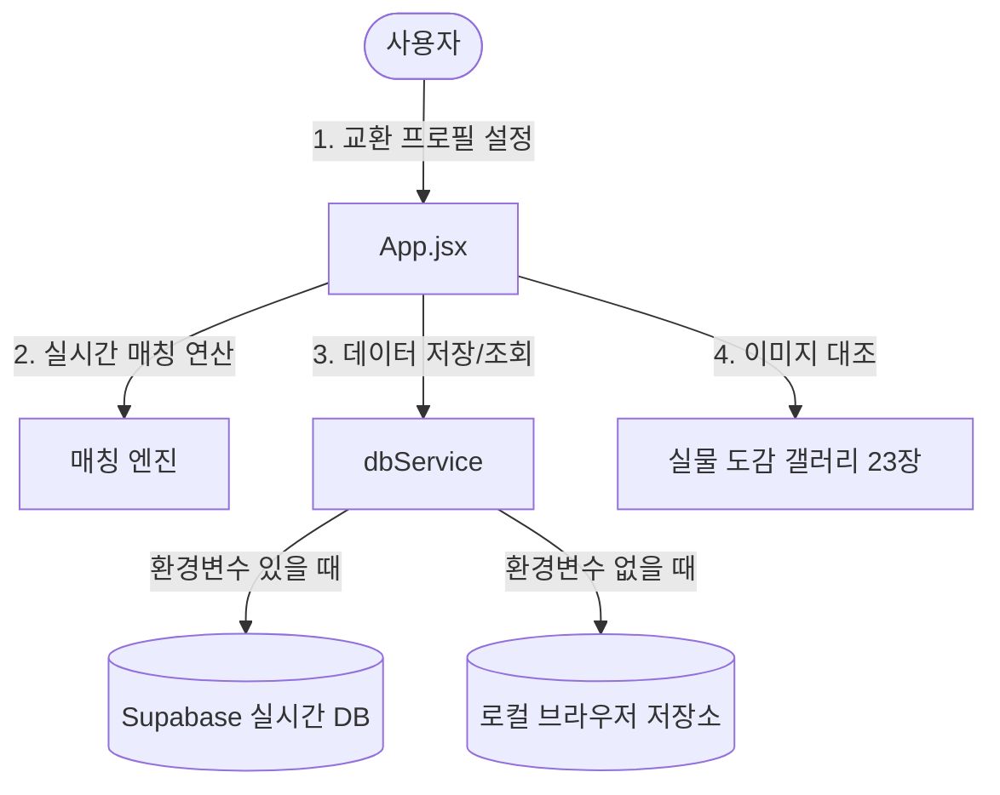

# 🗺️ 드래곤 빌리지 3 카드교환소 마스터 청사진 (MASTER_BLUEPRINT)

본 문서는 프로젝트의 전체 설계 구조와 데이터 흐름을 초보자분들이 쉽게 이해할 수 있도록 정리한 마스터 청사진입니다.

---

## 🏗️ 시스템 아키텍처

---

## 📂 파일 구조 설명

이 프로젝트의 핵심 파일들은 다음과 같이 배치되어 있습니다:

- **`index.html`**
  - 사이트의 뼈대가 되는 파일입니다. 검색엔진 노출을 위한 정보(SEO)와 한국어 설정이 적용되어 있습니다.
- **`src/main.jsx`**
  - React 앱의 진입점으로, `App.jsx`와 `index.css`를 연결해 브라우저에 화면을 띄워주는 역할을 합니다.
- **`src/App.jsx`**
  - **애플리케이션의 핵심**입니다. 닉네임 등록, 카드 추가/삭제 기능, 유저간 가진 카드와 필요한 카드를 비교하는 매칭 알고리즘, 실물 도감 앨범 렌더링이 모두 여기에 담겨 있습니다.
- **`src/index.css`**
  - 앱 전체의 옷을 담당하는 스타일 시트입니다. 불꽃과 어둠의 조화로운 다크그라데이션 및 뒷배경이 비치는 듯한 유리 같은 디자인(글래스모피즘)이 정의되어 있습니다.
- **`src/stickersData.js`**
  - 드래곤 빌리지 3의 카드 목록(고대신룡, 다크닉스 등)과 각 카드의 등급(레전드, 히어로 등)을 모아둔 데이터 사전입니다.
- **`src/supabaseClient.js`**
  - 데이터 저장소와 통신을 담당합니다. 데이터베이스 연결이 되지 않았을 때도 사용자가 사이트를 시험 운전해볼 수 있도록 "가짜 브라우저 저장소(LocalStorage)" 기능을 백업으로 품고 있습니다.

---

## ⚡ 교환 매칭의 원리

1. 유저 A가 **보유 카드 목록**에 `고대신룡`을 넣고, **원하는 카드 목록**에 `다크닉스`를 입력합니다.
2. 마침 등록된 게시글 중에 유저 B가 `다크닉스`를 가지고 있고, `고대신룡`을 찾고 있다면 매칭 엔진이 이를 분석합니다.
3. 두 조건이 서로 크로스(교차)하여 일치하므로, 해당 게시글에 **`⚡ 교환 매칭 성사!`** 뱃지가 뜨고 "내가 줄 것: 고대신룡, 받을 것: 다크닉스" 형태의 교환 시나리오가 자동으로 그려집니다.

---

## 🗓️ 업데이트 기록 (2026-06-04)
- **최초 프로젝트 생성**: Vite React 기반의 프로젝트 뼈대 구축.
- **매칭 시스템 구현**: 닉네임, 연락처 및 카드 교차 매칭 알고리즘 작성.
- **실물 도감 추가**: 사용자가 전달한 23개의 캡쳐 이미지를 웹 앱 내 갤러리 형태로 탑재하고, 팝업 확대(Lightbox) 기능 추가.
- **테스트 및 검증**: 프로덕션 빌드 무오류 통과.
