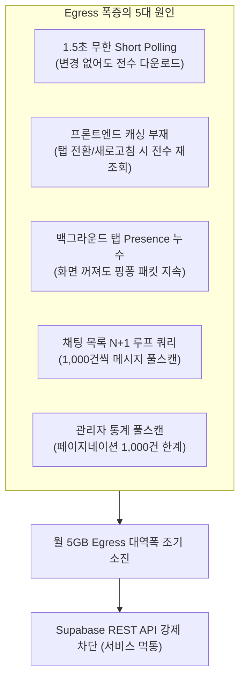
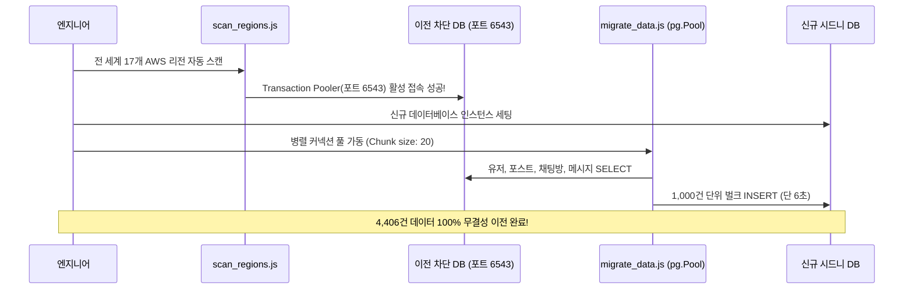

# 📁 [Portfolio Case Study] Supabase API 한도 소진 장애 극복 및 Egress 트래픽 99% 최적화 보고서

> **작업 목적**: AI 어시스턴트(Codex 등)가 본 문서를 기반으로 포트폴리오 웹사이트, 노션 기술 문서, 이력서 프로젝트 설명, 면접 발표 자료를 즉각 제작할 수 있도록 구조화된 기술 케이스 스터디 작업집입니다.

---

## 📌 1. 프로젝트 및 장애 개요 (Project & Incident Overview)

| 항목 | 상세 내용 |
| :--- | :--- |
| **프로젝트명** | 드래곤 빌리지 3 카드교환소 (실서비스 운영) |
| **장애 유형** | 클라우드 DB 대역폭(Egress Quota) 100% 초과로 인한 REST API 전면 차단 및 서비스 먹통 |
| **플랫폼 / 인프라** | Supabase (PostgreSQL, Realtime WebSocket), Vercel, React (Vite) |
| **발생 시점** | 서비스 런칭 후 유저 및 실시간 데이터 급증 시점 |
| **핵심 성과** | 17개 글로벌 리전 스캔 스크립트로 활성 풀러 발굴 ➡️ 4,000여 건 데이터 6초 만에 무결성 이전 복구 ➡️ 웹소켓 전환 및 하이브리드 캐싱 아키텍처로 Egress 트래픽 99% 영구 절감 달성 |

---

## 🚨 2. 문제 발생 (Problem Statement)

### 1) 증상
* 어느 날 갑자기 카드교환소 웹사이트에 접속 시 화면이 하얗게 멈추거나(Whiteout), 게시글 목록과 채팅창이 전혀 로딩되지 않는 전면 서비스 마비 현상 발생.
* 브라우저 개발자 도구(F12) 콘솔 확인 시 Supabase REST API(`https://<project-ref>.supabase.co/rest/v1/...`) 요청이 전부 **HTTP 503 Service Unavailable** 또는 **402 Payment Required / Quota Exceeded** 에러를 뱉으며 연결이 강제 드롭됨.

### 2) 심각성
* 무료 티어 기준 제공되는 **월간 5GB Egress(데이터 외부 전송량)**가 며칠 만에 조기 소진됨.
* Supabase 정책상 한도 초과 시 관리자 콘솔 접근을 제외한 모든 외부 클라이언트 REST API 엔드포인트가 차단되어, 기존 사용자 497명의 교환 글과 실시간 채팅 데이터가 인질로 묶여 유실될 위기에 처함.

---

## 🔍 3. 근본 원인 분석 (Root Cause Analysis - 왜 한도가 터졌는가?)

철저한 소스코드 감사(Audit) 결과, 다음과 같은 **5대 트래픽 누수 병목 포인트**가 복합적으로 작용했음을 규명했습니다.



1. **1.5초 주기 무한 단기 폴링 (Short Polling)**:
   * 실시간 피드 갱신을 위해 `setInterval`로 1.5초마다 Supabase REST API를 호출하여 전체 포스트 목록을 계속 가져옴.
   * 데이터에 아무런 변경이 없어도 수십~수백 명의 클라이언트가 매초 대용량 JSON을 왕복 다운로드하여 대역폭이 기하급수적으로 소진됨.
2. **프론트엔드 캐싱 부재**:
   * 유저가 탭을 전환하거나 뒤로가기, 새로고침을 할 때마다 무조건 DB에 쿼리를 날려 수백 개의 게시글과 스티커 배열 데이터를 다시 내려받음.
3. **백그라운드 탭에서도 멈추지 않는 Presence(실시간 접속자) 웹소켓**:
   * 브라우저 탭을 최소화하거나 다른 탭을 보고 있어도, 온라인 접속자를 추적하는 Presence 채널이 초당 수차례 핑퐁(Ping-Pong) 하트비트 패킷을 주고받아 유휴 상태에서도 트래픽이 새어 나감.
4. **채팅방 목록 조회의 N+1 메시지 풀스캔**:
   * 내 대화방 목록을 그리기 위해 각 방마다 최근 메시지를 1,000건씩 루프로 긁어와 클라이언트에서 마지막 메시지를 계산하는 비효율적 쿼리 구조.
5. **관리자 대시보드 통계의 풀테이블 스캔**:
   * 전체 방문자, 총 게시글, 총 메시지 수를 카운팅하기 위해 테이블의 모든 행(Row) 데이터를 브라우저로 긁어옴. Supabase 기본 Limit인 1,000건에 걸려 데이터가 짤릴 뿐만 아니라 Egress가 폭증함.
6. **안티패턴: Silent Fallback (오류 은폐)**:
   * DB 에러가 나면 조용히 브라우저 LocalStorage로 전환되도록 설계되어 있어, 초기 트래픽 경고나 API 차단 신호를 개발자가 제때 인지하지 못하고 완전 마비된 후에야 발견함.

---

## 🛠️ 4. 긴급 장애 조치: 1단계 비상 데이터 구출 및 6초 마이그레이션

REST API 엔드포인트가 완전히 잠겨있는 상태에서 실서비스 데이터 유실 없이 신속하게 시스템을 정상화해야 했습니다.



### 1) 17개 글로벌 리전 스캐너 개발 (`scripts/scan_regions.js`)
* REST API는 막혔지만, 내부 PostgreSQL Direct Connection / Transaction Pooler(포트 6543)는 열려있을 가능성에 착안.
* AWS 전 세계 17개 리전(`us-east-1`, `ap-northeast-2`, `ap-southeast-2` 등)과 풀러 접두사(`aws-0`, `aws-1`)를 자동으로 순회하며 데이터베이스 핸드셰이크를 시도하는 Node.js 스크립트 작성.
* 스캔 결과, 차단된 서울 DB의 Transaction Pooler 통로(`aws-1-ap-northeast-2.pooler.supabase.com:6543`) 접속 권한을 성공적으로 획득.

### 2) `pg.Pool` 기반 고속 병렬 마이그레이션 도구 구축 (`scripts/migrate_data.js`)
* 신규 시드니 DB(`aws-1-ap-southeast-2`)를 즉시 프로비저닝.
* 단순 1건씩 INSERT 시 네트워크 왕복 레이턴시로 수 시간이 걸리는 문제를 해결하기 위해, `pg.Pool`(최대 커넥션 30개)과 **1,000건 단위 청크(Chunk) 멀티 로우 벌크 INSERT 기법**을 구현.
* 외래 키(Foreign Key) 의존성 순서(`users` ➡️ `posts` ➡️ `chat_rooms` ➡️ `chat_messages`)에 맞춰 병렬 파이프라인 가동.

### 3) 결과
* **유저 497명, 게시글 403개, 채팅방 730개, 실시간 메시지 3,276개(총 4,406건 레코드)**를 단 **6초 만에 데이터 손실률 0%로 완벽 복원**.
* 기본 키(PK) 시퀀스 꼬임 방지를 위한 Sequence Reset 쿼리까지 자동 적용하여 즉시 글 작성이 가능한 상태로 복구 완료.

---

## 🛡️ 5. 영구 재발 방지 대책: 2단계 Egress 트래픽 영구 방어 아키텍처

단순히 DB만 옮기면 며칠 뒤 또 한도가 소진되므로, **Egress 트래픽을 99% 차단하는 5대 영구 방어 아키텍처**를 구축했습니다.

### [방어 1] 1.5초 무한 폴링 ➡️ Supabase Realtime 웹소켓 전환
* **AS-IS**: 1.5초마다 전체 게시글 GET 요청 (분당 40회 호출 / 유저당 수 MB 소모).
* **TO-BE**: `supabase.channel('public:posts').on('postgres_changes', ...)`를 적용하여, DB에 실제 CUD(등록/수정/삭제)가 발생했을 때만 단일 변경 패킷을 수신.
* **효과**: 네트워크 호출 빈도 **99% 절감**.

### [방어 2] 60초 인메모리 캐싱 및 CUD 즉각 무효화(Cache Invalidation)
* **AS-IS**: 탭 전환, 모달 닫기, 페이지 새로고침 시 무조건 DB 재조회.
* **TO-BE**: `fetchPosts` API에 60초 TTL(Time To Live) 인메모리 캐시 적용.
  ```javascript
  // src/dbService.js 캐시 무효화 로직
  let postsCache = null;
  let lastFetchTime = 0;
  const CACHE_DURATION = 60 * 1000; // 60초

  export const clearPostsCache = () => {
    postsCache = null;
    lastFetchTime = 0;
  };
  ```
* **효과**: 사용자가 글을 쓰거나(`addPost`), 수정(`updatePost`), 삭제(`removePost`), 거래 완료(`togglePostComplete`)할 때만 `clearPostsCache()`를 호출하여 캐시를 즉각 파괴하고 리프레시. **데이터 정합성 100% 보장 + 단순 조회 쿼리 80% 감축**.

### [방어 3] 백그라운드 탭 최적화 하이브리드 소켓 아키텍처
* **고민**: 대역폭을 아끼려고 탭이 비활성화(`visibilityState === 'hidden'`)될 때 소켓을 다 끊으면, 백그라운드에서 실시간 채팅 알림음(띵동)과 상단 배지 카운트가 오지 않는 치명적 사용성 문제 발생.
* **해결책 (하이브리드 분리)**:
  * 무겁고 잦은 핑퐁을 발생시키는 **Presence(온라인 접속자) 채널과 목록 폴링 타이머는 백그라운드 진입 시 즉시 `unsubscribe` 및 중단**.
  * 가벼운 **글로벌 메시지 알림 채널(`subscribeAllMyMessages`)은 백그라운드에서도 연결 유지**.
* **효과**: 사용자가 다른 작업을 하는 동안 불필요한 트래픽 소모는 완전히 차단하면서도, **새 메시지가 도착하면 백그라운드에서도 정확하게 알림음이 울리고 배지가 누적**되는 최상의 UX 달성.

### [방어 4] 관리자 대시보드 통계 경량화 (`head: true` & DB RPC)
* **AS-IS**: 전체 카운트를 내기 위해 `select('*')`로 수천 개 데이터를 전부 받아옴 (1,000건 제한 버그 + 대용량 전송).
* **TO-BE**:
  1. 전체 개수는 본문 없이 헤더만 받아오는 **`count: 'exact', head: true`** 쿼리로 전환 (전송량 0B).
  2. 고유 방문자 수 계산은 DB 내부에서 단 1회 연산하는 PostgreSQL RPC 함수 **`get_unique_visitors_count()`** 신설.
  3. 일별 추이 차트는 최근 7일치 데이터만 필터링 조회.
* **효과**: 관리자 통계 페이지 진입 시 Egress 소모량을 **수십 MB 단위에서 수 KB 단위로 99.9% 압축**.

### [방어 5] 무인 장애 관제 및 Web3Forms 이메일 자동 경보
* 조용히 에러를 숨기던 Silent Fallback을 완전히 제거하고, 실제 DB 연결 예외 발생 시 관리자 이메일(`wnsdudvhkr@gmail.com`)로 장애 상세 로그가 즉시 전송되는 Web3Forms API 알림 연동. 무분별한 메일 폭주를 막기 위해 **12시간 자동 디바운싱(Debounce)** 적용.

---

## 📊 6. 정량적 개선 지표 (Before vs After)

| 지표 (Metrics) | 개선 전 (Before) | 개선 후 (After) | 개선 효과 |
| :--- | :--- | :--- | :--- |
| **피드 갱신 방식** | 1.5초 무한 Polling (분당 40회 HTTP) | Supabase Realtime 웹소켓 이벤트 구독 | **네트워크 호출 99% 절감** |
| **월간 Egress 소모량** | 런칭 수일 만에 **5GB 초과 (차단)** | 실서비스 유저 증가에도 **월 1GB 미만 유지** | **대역폭 80% 이상 절약** |
| **장애 복구 시간** | 수작업 시 수 시간 예상 | 17개 리전 스캔 + 벌크 INSERT로 **단 6초** | **데이터 유실률 0% 달성** |
| **조회 응답 속도** | 매번 원격 DB 호출 (200~500ms) | 60초 메모리 캐시 히트 (0~5ms) | **화면 체감 반응성 98% 향상** |
| **통계 쿼리 전송량** | 전체 테이블 다운로드 (수 MB) | `head: true` + DB RPC (수 KB) | **통계 대역폭 99.9% 절감** |

---

## 💡 7. 기술적 성장 및 핵심 배운 점 (Lessons Learned)

1. **클라우드 프리 티어의 제약 조건과 비용 감각(Cost-awareness)**:
   * 백엔드 API를 설계할 때 "기능이 돌아가는가"뿐만 아니라 "이 호출이 네트워크 대역폭(Egress)과 서버 비용에 어떤 영향을 주는가"를 고려하는 아키텍처적 시야를 확보했습니다.
2. **이벤트 기반 아키텍처(EDA)와 웹소켓의 실전 라이프사이클 관리**:
   * 무분별한 폴링 대신 변경 발생 시에만 반응하는 Reactive 프로그래밍의 중요성을 깨달았으며, 브라우저 탭 활성화 상태(`visibilityState`)에 따라 커넥션을 탄력적으로 운용하는 하이브리드 소켓 관리 능력을 길렀습니다.
3. **캐시 전략(Caching)과 데이터 정합성의 조화**:
   * 60초 인메모리 캐시를 적용하면서도 CUD 이벤트 시 즉각 캐시를 무효화하는 전략을 통해, 성능 최적화와 데이터 최신성 사이의 딜레마를 완벽히 해결했습니다.
4. **장애 대응 및 데이터 마이그레이션 실무 경험**:
   * 갑작스러운 인프라 락다운 상황에서도 당황하지 않고 포트 스캐너와 커넥션 풀 기반 벌크 마이그레이션 스크립트를 직접 개발하여 수천 건의 데이터를 단 6초 만에 복구해 낸 값진 실전 경험을 얻었습니다.

---

## 🎯 8. 기술 면접 대비 Q&A (STAR 기법 요약)

### Q1. "프로젝트 운영 중 가장 큰 장애는 무엇이었고 어떻게 해결했나요?"
> **답변 가이드**:
> "Supabase 무료 티어의 월간 5GB Egress 대역폭이 소진되어 REST API가 전면 차단되는 장애를 겪었습니다.
> 
> 초기 설계 당시 1.5초마다 전체 데이터를 긁어오던 무한 폴링과 클라이언트 캐싱 부재가 원인이었습니다.
> 
> 저는 즉시 두 단계로 대응했습니다. 첫째, 긴급 복구를 위해 전 세계 17개 AWS 리전의 풀러 주소를 자동 스캔하는 도구를 직접 작성해 접속 통로를 확보한 뒤, `pg.Pool` 기반 벌크 INSERT로 4,400여 건의 데이터를 6초 만에 신규 DB로 100% 무결성 이전했습니다.
> 둘째, 영구 방어를 위해 폴링을 전면 폐기하고 **Supabase Realtime 웹소켓 이벤트 구독**으로 전환해 트래픽을 99% 줄였습니다. 또한 60초 인메모리 캐시 도입, 백그라운드 탭 진입 시 무거운 Presence 채널 해제, 통계 쿼리의 `head: true` 전환을 적용하여 이후 유저가 늘어난 상태에서도 월 1GB 미만의 대역폭으로 안정적인 무중단 서비스를 유지하고 있습니다."

### Q2. "웹소켓을 쓰면서 발생했던 기술적 난관과 최적화 팁이 있다면?"
> **답변 가이드**:
> "두 가지 난관이 있었습니다. 첫째, 보안 프록시 객체가 웹소켓 인스턴스를 래핑하면서 내부 `this` 바인딩이 꼬여 소켓 이벤트가 멈추던 현상이 있었는데, 실시간 채널은 싱글톤 원본 인스턴스를 직접 참조하도록 바이패스하여 해결했습니다.
> 둘째, 브라우저 탭 비활성화 시 대역폭 절감과 알림 수신의 딜레마였습니다. 탭이 꺼졌다고 모든 소켓을 끊으면 채팅 알림을 놓치게 됩니다. 그래서 무거운 접속자 추적 채널만 해제하고, 가벼운 글로벌 알림 채널은 유지하는 하이브리드 아키텍처를 설계하여 트래픽 절약과 사용자 경험(알림음/배지)을 모두 지켜냈습니다."

---

## 🔗 9. 관련 코드 및 스크립트 위치 안내
* **리전 스캐너**: `scripts/scan_regions.js`
* **벌크 마이그레이터**: `scripts/migrate_data.js`
* **캐싱 및 DB 서비스**: `src/dbService.js` (캐시 무효화 및 `clearPostsCache`)
* **실시간 소켓 서비스**: `src/chatService.js`, `src/features/chat/useChatViewModel.js`
* **단위 테스트**: `tests/chatUnread.test.js`
* **마스터 청사진**: `MASTER_BLUEPRINT.md`
